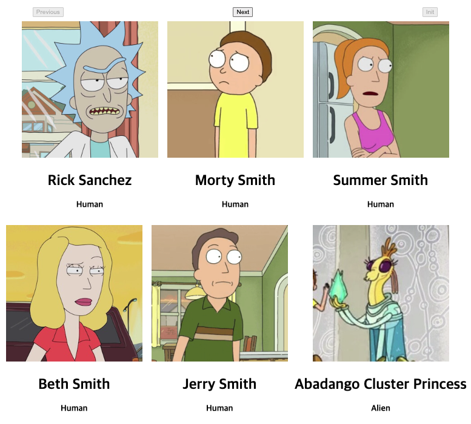

# Rick and Morty

## Desc

- Svelte
- Vite

## Init

```
  npm create vite
  > svelte-ts
```

```
  npm i
  npm run dev
```

## Result

- Vite 빠르다
- Svelte 좋다

## Reference

- https://rickandmortyapi.com/

```json
{
  "characters": "https://rickandmortyapi.com/api/character",
  "locations": "https://rickandmortyapi.com/api/location",
  "episodes": "https://rickandmortyapi.com/api/episode"
}
```


